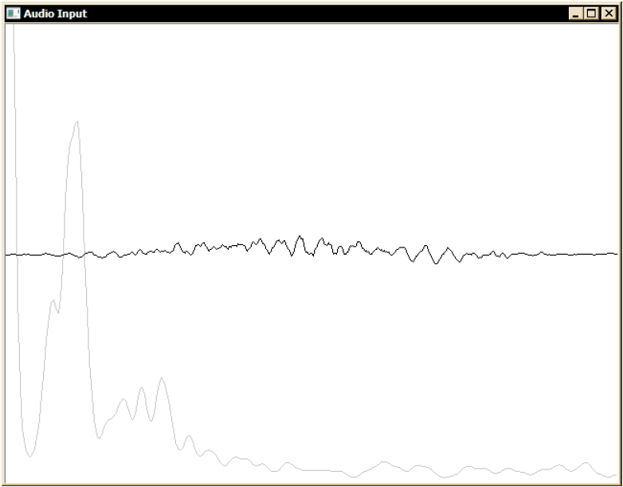
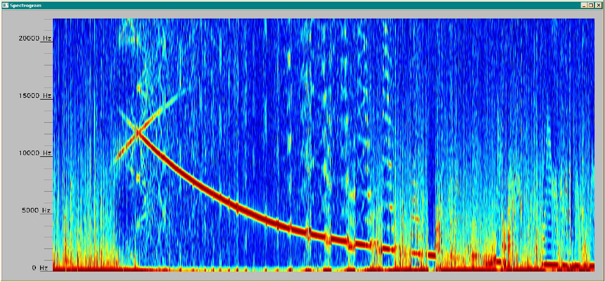

# Audio Spectrogram
The goal of this project was to create a Waterfall Spectrum, or in other words a Spectrogram using the microphone and the Short-Time Fourier Transform (STFT).

# Implementation
For the implementation, the project used the Microsoft Windows Waveform Audio, Microsoft Visual Studio with C/C++ and OpenCV. The Microsoft Waveform Audio provides several methods for adding sound to an application. The API methods are relatively low-level and require some more accurate parameterization. In [Audio_Spectrogram.cpp](Audio_Spectrogram.cpp) the parameterization can be seen for a microphone input signal of 44.1 kHz sampling frequency with mono channel.

The next step for the implementation was to use the input from the microphone and transfer it to the frequency domain. Since the input is a stream, the input has to be processed in blocks. To enable this, the project resorts to the STFT (Short-term Fourier Transform). To prepare the input signal, a Hanning window is used. This should reduce the leakage in each resulting frequency spectrum. The input samples are set to 512 samples. To ensure better visualization, each frequency spectrum is in logarithmic magnitude and each one is normalized. The advantage is clearer visualizations, but the disadvantage is that when the magnitude is lower, the noise gets amplified more during the normalization.

To realize the signal processing as well as the visualization, the project uses the methods from the OpenCV library. For the visualization, the project simply uses a circular buffer where each new generated line represents an incoming element. The highgui visualizes then the whole spectrogram that is already generated. When it reaches the end, it simply discards the last elements.

This screenshot shows the audio input and the frequency spectrom recorded from the microphone.

This screenshot shows the spectrogram for the input from a human hearing test which ranged from 20 Hz to 20 kHz.

# License
This project is licensed under the Apache 2.0 license, which can be seen in [LICENSE](LICENSE). The [Wave.cpp](Wave.cpp) and [Wave.h](Wave.h) are from the project [CWave - A Simple C++ Class to Manipulate WAV Files](https://www.codeproject.com/Articles/29676/CWave-A-Simple-C-Class-to-Manipulate-WAV-Files) licensed under the [The Code Project Open License (CPOL) 1.02](https://www.codeproject.com/info/cpol10.aspx) license.
